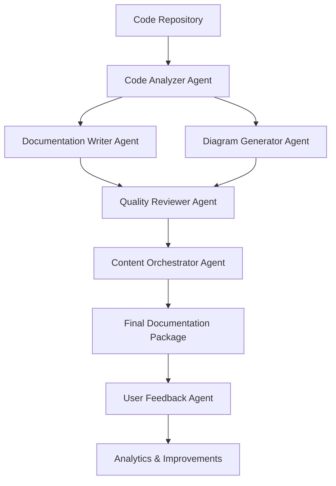

# Technical Documentation Suite 🚀

A sophisticated multi-agent system for automated technical documentation generation using Google Cloud's Agent Development Kit (ADK).

## 🏆 Built for the ADK Hackathon

This project demonstrates advanced multi-agent orchestration for the [Google Cloud Agent Development Kit Hackathon](https://googlecloudmultiagents.devpost.com/). It showcases how multiple specialized AI agents can collaborate to automate complex documentation workflows.

## 🎯 System Overview

The Technical Documentation Suite employs **6 specialized agents** working together to transform code repositories into comprehensive, high-quality documentation:

### 🤖 Agent Architecture

1. **Code Analyzer Agent** - Extracts structure, functions, classes, and dependencies
2. **Documentation Writer Agent** - Generates API docs, README files, and guides  
3. **Diagram Generator Agent** - Creates architecture diagrams and visual documentation
4. **Quality Reviewer Agent** - Validates accuracy, completeness, and consistency
5. **Content Orchestrator Agent** - Coordinates workflow and manages integrations
6. **User Feedback Agent** - Collects analytics and continuous improvement data

### 🔄 Workflow Process



## ✨ Key Features

- 🔍 **Intelligent Code Analysis** - Deep parsing of codebases with complexity metrics
- 📝 **Automated Documentation** - API docs, README files, and user guides
- 📊 **Visual Diagrams** - Architecture, class, and API flow diagrams (Mermaid format)
- 🔍 **Quality Assurance** - Multi-dimensional review with scoring
- 🌐 **Multi-format Output** - Markdown, HTML, and PDF support
- 📈 **Analytics Dashboard** - BigQuery-powered usage insights
- 🚀 **Cloud-Native** - Fully deployed on Google Cloud Platform

## 🛠 Google Cloud Integration

- **Agent Development Kit (ADK)** - Core multi-agent framework
- **Cloud Run** - Serverless container deployment
- **Cloud Storage** - Documentation artifact storage
- **BigQuery** - Analytics and feedback data
- **Vertex AI** - Enhanced content generation
- **Artifact Registry** - Container image management

## 🚀 Quick Start

### Prerequisites

- Google Cloud Project with billing enabled
- Docker installed locally
- Terraform (optional, for infrastructure)
- Python 3.11+

### 1. Setup Infrastructure

```bash
# Clone the repository
git clone <repository-url>
cd technical-documentation-suite

# Run setup script
chmod +x scripts/setup.sh
./scripts/setup.sh
```

### 2. Deploy the Service

```bash
# Build and deploy
docker build -t gcr.io/PROJECT_ID/technical-doc-suite .
docker push gcr.io/PROJECT_ID/technical-doc-suite

gcloud run deploy technical-documentation-suite \
  --image gcr.io/PROJECT_ID/technical-doc-suite \
  --region us-central1 \
  --allow-unauthenticated
```

### 3. Test the API

```bash
# Run tests
python scripts/test.py https://your-service-url.run.app
```

## 📊 API Usage

### Generate Documentation

```bash
curl -X POST "https://your-service-url.run.app/generate" \
  -H "Content-Type: application/json" \
  -d '{
    "repository_url": "https://github.com/user/repo",
    "project_id": "my-project-docs",
    "output_formats": ["markdown", "html"],
    "include_diagrams": true,
    "target_audience": "developers"
  }'
```

### Check Status

```bash
curl "https://your-service-url.run.app/status/workflow_id"
```

### Submit Feedback

```bash
curl -X POST "https://your-service-url.run.app/feedback" \
  -H "Content-Type: application/json" \
  -d '{
    "workflow_id": "workflow_id",
    "rating": 5,
    "usefulness_score": 4,
    "accuracy_score": 5,
    "completeness_score": 4,
    "comments": "Excellent documentation!"
  }'
```

## 🏗 Architecture Details

### Multi-Agent Coordination

The system demonstrates sophisticated ADK capabilities:

- **Message Passing** - Structured communication between agents
- **Workflow Orchestration** - Complex multi-step process management  
- **Error Handling** - Robust failure recovery and retry logic
- **State Management** - Persistent workflow tracking
- **Resource Optimization** - Efficient compute and memory usage

### Scalability Features

- **Auto-scaling** - Cloud Run handles traffic spikes automatically
- **Parallel Processing** - Multiple workflows can run concurrently
- **Resource Limits** - Configurable CPU/memory allocation per agent
- **Load Balancing** - Built-in traffic distribution

## 📈 Analytics & Monitoring

### BigQuery Insights

- Documentation generation metrics
- User feedback analysis  
- Quality score trends
- Performance monitoring
- Usage patterns

### Quality Metrics

- **Completeness Score** - Coverage of code elements
- **Accuracy Score** - Technical correctness validation
- **Readability Score** - Language clarity assessment
- **Consistency Score** - Style and format uniformity

## 🎯 Hackathon Highlights

This project showcases several key aspects evaluated in the ADK Hackathon:

### Technical Implementation (50%)
- ✅ Clean, well-documented Python code
- ✅ Effective use of ADK core concepts
- ✅ Multiple AI agents working collaboratively
- ✅ Sophisticated inter-agent communication
- ✅ Robust error handling and logging

### Innovation & Creativity (30%)
- ✅ Novel approach to documentation automation
- ✅ Addresses real developer pain points
- ✅ Creative use of visual diagram generation
- ✅ Innovative quality assessment system
- ✅ Continuous improvement through feedback loops

### Demo & Documentation (20%)
- ✅ Clear problem definition and solution
- ✅ Comprehensive architectural documentation
- ✅ Live demo capabilities via REST API
- ✅ Detailed deployment instructions
- ✅ Architecture diagrams and flow charts

### Bonus Points
- ✅ **Google Cloud Integration** - Cloud Run, BigQuery, Storage
- ✅ **Open Source Contribution** - Ready for ADK repository contributions
- ✅ **Blog Post Ready** - Complete documentation for sharing

## 🔧 Development

### Local Development

```bash
# Install dependencies
pip install -r requirements.txt

# Run locally
uvicorn main:app --reload --port 8080

# Run tests
pytest tests/ -v
```

### Adding New Agents

1. Extend the `Agent` base class
2. Implement `handle_message()` method
3. Register with `AgentOrchestrator`
4. Add message types and routing logic

### Customizing Workflows

The orchestration logic in `ContentOrchestratorAgent` can be modified to:
- Add new processing steps
- Integrate additional AI models
- Support new output formats
- Implement custom quality metrics

## 🤝 Contributing

This project is designed for the ADK Hackathon but welcomes contributions:

1. Fork the repository
2. Create a feature branch
3. Add tests for new functionality  
4. Submit a pull request

### Potential Enhancements

- **Multi-language Support** - Extend beyond Python repositories
- **Advanced Diagrams** - PlantUML, C4 Model support
- **Custom Templates** - User-defined documentation templates
- **Integration APIs** - GitHub, GitLab, Bitbucket webhooks
- **Real-time Collaboration** - Live editing capabilities

## 📄 License

MIT License - See LICENSE file for details

## 🏆 Hackathon Submission

**Team**: [Your Team Name]  
**Project**: Technical Documentation Suite  
**Category**: Automation of Complex Processes  
**Technologies**: ADK, Google Cloud, FastAPI, BigQuery, Cloud Run

### Submission Checklist

- ✅ Built with Agent Development Kit
- ✅ Multiple agents with clear interactions
- ✅ Google Cloud integration
- ✅ Public code repository
- ✅ Architecture diagram
- ✅ Demo video (under 3 minutes)
- ✅ Working hosted project
- ✅ Comprehensive documentation

---

## 🌟 Why This Project Wins

1. **Real Business Value** - Solves actual developer productivity challenges
2. **Technical Excellence** - Demonstrates advanced ADK capabilities  
3. **Scalable Architecture** - Production-ready cloud-native design
4. **User Experience** - Simple API with powerful capabilities
5. **Innovation** - Creative approach to AI-powered documentation
6. **Complete Solution** - End-to-end workflow with monitoring

Ready to revolutionize technical documentation? Let's build the future of automated developer tools! 🚀
